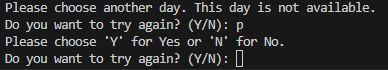

# Link to Repository:

You can find a source code in this [LINK](https://github.com/RamizSaeed/Coder_academy_learning/tree/main/Coder_academy_learning/pyth-training/T1A3)

# Link to my YouTube Channel:
You can find a source of my presentation in this [Link](https://www.youtube.com/watch?v=q5eAGIeqymI)

# Software Development Idea: Clinic Appointment Booking and Reminder


**Description:** 

The terminal app aims to facilitate the booking of appointments at a clinic and send appointment reminders to patients. It provides a user-friendly interface to schedule appointments, store patient information, and send automated reminders to ensure patients don't miss their scheduled appointments.

**Purpose:**

The purpose of this terminal project is to provide a simple and efficient way for patients to book appointments at a clinic, manage their appointments, and receive appointment reminders. The application aims to streamline the appointment booking process and improve communication between patients and the clinic. 

**The problem:** 

Traditional methods of booking appointments at clinics can be inconvenient and prone to miscommunication. Patients often face challenges in accessing information about available appointment dates, experience delays and errors in manual booking processes, and may forget their scheduled appointments due to a lack of reminders. Communication between clinics and patients can also be inefficient, leading to difficulties in sending reminders or managing changes in appointments.

 **Target Audience:** 
 
 The target audience for this terminal application is patients who need to schedule appointments at the clinic. It can be used by individuals of all ages who have access to a terminal or command-line interface. The application provides a convenient and straightforward method for patients to view available dates, book appointments, delete appointments if needed, and receive reminders to ensure they don't miss their scheduled appointments. The target audience may include patients who prefer using the command line or terminal for various reasons, such as familiarity with the interface, efficiency, or automation capabilities.

# Features

This section represents the main control flow of the appointment clinic app, providing a comprehensive set of features to facilitate the booking and management of appointments. The app enables patients to view available dates, allowing them to check the availability before finalizing their appointment. These features include:

1. View Available Dates: Patients can access a calendar view to see which days are available for booking appointments. This feature helps patients plan their appointments conveniently by checking the availability in advance.
2. Booking Appointment: Patients can enter their name, contact number, email (optional), and desired appointment date. The application will save this information to the CSV file.
3. Cancelation Appointment: Patients can delete their appointment by entering their name. The application will remove the corresponding entry from the CSV file.
4. Send Reminders: The application will automatically send appointment reminders to patients on the day of their appointment. Reminders will be sent via email (if provided) using SMTP.
# Control Flow Diagram:


# Implementation 

1.	The application will use the csv module in Python to read and write data to a CSV file.

2.	The CSV file will have the following columns: "name", "contact_number", "email", and "appointment_date".

3.	The application will have functions to load the existing patient data from the CSV file, save new patient data to the CSV file, view available dates and delete patient data from the CSV file.

4.	When a patient books an appointment, the application will prompt the patient to enter their details and save the appointment information to the CSV file.

5.	When a patient wants to delete an appointment, the application will ask for the patient's name, search for the corresponding entry in the CSV file, and remove it if found.

6.	The application will have a function to send appointment reminders. It will compare the current date with the appointment date in the CSV file and send reminders to patients whose appointment date matches the current date. Reminder emails will be sent using the SMTP protocol.

7.	The application will display a menu with options for viewing availability, booking appointments, deleting appointments, sending reminders, and quitting the application.

8.	The main program loop will repeatedly display the menu and prompt the user for their choice. Based on the user's input, the corresponding function will be called to perform the desired action.

9.	The application will handle any errors or exceptions gracefully and provide informative error messages to the user.

## out of scope

1. The application will not indicate the hours of appointments.
2. This application designed for patients so this will not link with Doctor app.
3. The patient can not edit the information of certain appointment otherwise the application enable only delete previous appointment.
  

# Mangment plan:
To manage my project I used Trello boards alongside the app (as shown in the link bellow) to create my ideas which includes:
- Listing the requirements: This involves carefully identifying and documenting all the necessary features and functionalities that the app should possess. 
- Prioritizing requirements based on dependencies: Once the requirements are listed, it is essential to prioritize them based on their interdependencies.
- Starting with the main and simple elements: The initial focus should be on building the core aspects then gradually integarte accurate details.

## Link of Trello boards
You can find the Trello Board in [here](https://trello.com/invite/b/9uKN0boO/ATTId7fde05b861e757fe5a026698f267e9d08C7DF79/clinic)


# **Requirement/Features:** 

The user has the ability to interact with the appointment booking system in various ways, including viewing available dates, adding booking details, and deleting existing appointments.

Here's a breakdown of the different functionalities:

1. To view available dates, the application presents a menu with different options. The user selects option number 1 to access the available dates.

2. Adding a new appointment requires the user to select option number 2. The application prompts the user to provide details such as their name, contact number, email (optional), and the desired appointment date. Once the user enters this information, the application saves the details in the appointment list.

3. Deleting an appointment can be done by choosing option number 3. The user is asked to provide the contact name associated with the appointment they wish to delete.

4. By selecting option number 4, the user can request a reminder for their appointment. The application sends a reminder message to the user three days before the scheduled appointment.

5. Lastly, the user can easily exit the program by choosing option number 5, which corresponds to the "quit" functionality.

These options provide the user with a convenient way to interact with the appointment booking system, allowing them to view available dates, add new appointments, delete existing appointments, receive reminders, and gracefully exit the program when desired.


# **User interaction with the application**

Upon launching the app, the user will be greeted with a captivating top banner.


Simultaneously, a visually appealing main menu will be displayed, presenting five distinct options. The program prompts the user to enter their choice by selecting a number from 1 to 5. This allows the user to easily navigate the menu and make their desired selection. 

**Features:**

**To view available day for appointment** 

To proceed, the user is required to select option 1 from the menu and press the enter key. Upon selecting this option, the app will present the availability of days for the next two weeks (note that the code can be modified to change this duration). Here is an example of how the availability is displayed:


**To book new appointment** 

To proceed, the user should select option 2 from the main menu and then press the enter key. Upon selecting this option, the app will prompt the user to enter specific details, including their name, contact information, email (if applicable), and the desired appointment date. Here is an example of how the app presents the input fields:


if the booking was whithin available date then the app should give this mesaage:


Within the application, the user has the option to select option 5 in order to quit the program. Alternatively, they can choose other options such as deleting an appointment, booking another appointment, or viewing the availability again..

But what if the user choose an apointment date in mesatke which is not available see this example: 


In this scenario, the user is presented with the option to choose either "Y" for yes or "N" for no. Selecting "Y" allows the user to try again and input the correct date, while selecting "N" results in quitting from this particular option. However, if the user mistakenly presses any other letter apart from "Y" or "N," the app will prompt the user to make a valid choice again. Consider the following example: 




However, in the event that the user makes another mistake in date formatting, the app is designed to handle and accommodate the error. In such cases, the app will deliver the following message:


This approach ensures that the app acknowledges the mistake made by the user and provides guidance for inputting the correct date format. By gracefully handling such errors, the app strives to enhance the user experience and facilitate successful interactions.

**To cancle previous appointment**

To proceed with deleting an appointment, the user should choose option 3 from the main menu and press the enter key. After selecting this option, the app will prompt the user to enter the name associated with the appointment they wish to delete. Here is an example of how the process unfolds:


**To send reminder for appointment**

To send a reminder message to patients three days before their scheduled appointment (the duration can be adjusted within the app), the user should choose option 4 from the menu. However, it is essential to ensure that the correct email and app password are provided in the app's send_function to successfully execute the reminder process.

It is worth noting that even if incorrect email credentials are entered, the app will continue to function and display an error message, alerting the user about the issue. The app will then return to the menu options, allowing the user to make a different selection. Here's an example:


# Testing

Manual testing was conducted on the application to validate the functionality of the "View Available Days," "Book Appointment," and "Reminder" features. The tests covered three different scenarios, with each scenario consisting of three test cases. The results of these tests confirmed that the application is working as expected. For more information on testing, please refer to the Clinic App Test spreadsheet at the provided: 

## Link to the Clinic App Test spreadsheet:

Please clich her to see Clinic App Test spreadsheet [link](https://docs.google.com/spreadsheets/d/1ZjEnXHz5Oj8te3-MvndX3ExZW5dWXd8UU81QsOg-K2Q/edit?usp=sharing)

      


## Steps to install Clinic APP

**To install and run this program:**

1. Download and install Python if you have not already using this [link](https://www.python.org/downloads/)

2. Create a new directory on your terminal ("mkdir" followed by the name you want to call the directory)


3. go to the repository that holds the source code [here](https://github.com/RamizSaeed/Coder_academy_learning/tree/main/Coder_academy_learning/pyth-training/T1A3).

4. Click on Code and copy the link.

5. On your terminal : Type `git clone`, and then paste the URL you copied.

6. .Press **Enter** to create your local clone.

   if any error occurs please check this link from Github [here]
   (https://docs.github.com/en/repositories/creating-and-managing-repositories/cloning-a-repository) 


7. change directory to the src directory.

```
 cd src
```

10. Type this code into the terminal to start the application.

```
 ./script.sh
```

11. By default you will get 

```
permission denied:./script.sh
```

12. To give permission to execute the file

```
chmod +x script.sh
```

13. Then  this code to start the application.

```
 ./script.sh
```


## Requirments to send an email message from your app :

To utilize the SMTP protocol for sending emails, you'll need to follow the instructions provided in the [start here](https://postmarkapp.com/) guide.

Firstly, ensure you have an email account and generate an app password specific to your account (the app password may differ from your actual password).

To begin sending emails using SMTP in Python, you need to import the built-in smtplib module with the following statement:

```
    import smtplib
```
To send an email at a later stage, create an SMTP object using the following syntax:

```
    smtpObj = smtplib.SMTP([host [, port]])
```
Here are the parameter details for the SMTP object:

- `host` (optional): Specify the host running your SMTP server. You can use the IP address or domain name of the host.
- `port`: If you specify the `host` argument, you can provide the port number where the SMTP server is listening.
- `local_hostname`: If the SMTP server is running on your local machine, you can specify localhost.
  
The `SMTP` object has a method called `sendmail` which is used to send a message. It takes three parameters:

```
    smtpObj.sendmail(sender, receivers, message)
```
Here are the details of the `sendmail` parameters:

- `sender`: A string containing the email address of the sender.
- `receivers`: A list of strings, where each string represents the email address of a recipient.
- `message`: A string formatted as specified in RFCs, representing the email message.
  
To ensure that the `email` module is imported correctly and to access the complete description of its classes and arguments, you can type the following command in an interactive Python session:

```
    help(smtplib)
```

### Potential Ethical, Legal Implications:

To ensure the security and privacy of sensitive information, such as an API (Application Programming Interface) token and email address, it is recommended to store them in a secure location. One common practice is to use an .env file, which allows you to keep such credentials separate from your codebase.

By storing sensitive information in an .env file, you can ensure that it is not shared or exposed unintentionally. The .env file should be included in the project's .gitignore file to prevent it from being committed to a version control system.

When executing a file, it's important to be cautious, as the commands within the file are interpreted by the operating system. Executing a file without proper validation or safeguards can lead to potential risks and issues.

By following best practices, such as securely storing sensitive information and being mindful of file execution, you can help mitigate potential security risks and maintain the integrity of your system.

**I recommed not to execute the script file unless you understand very well the code in the repo.**