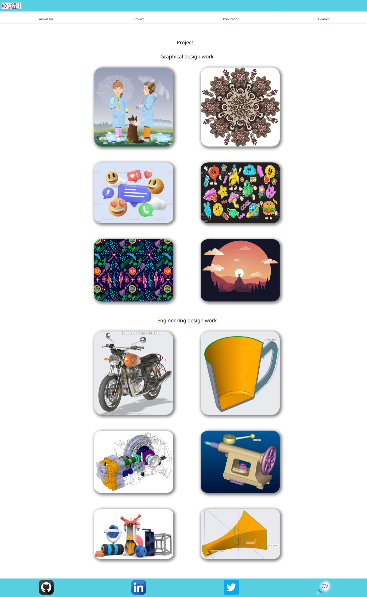
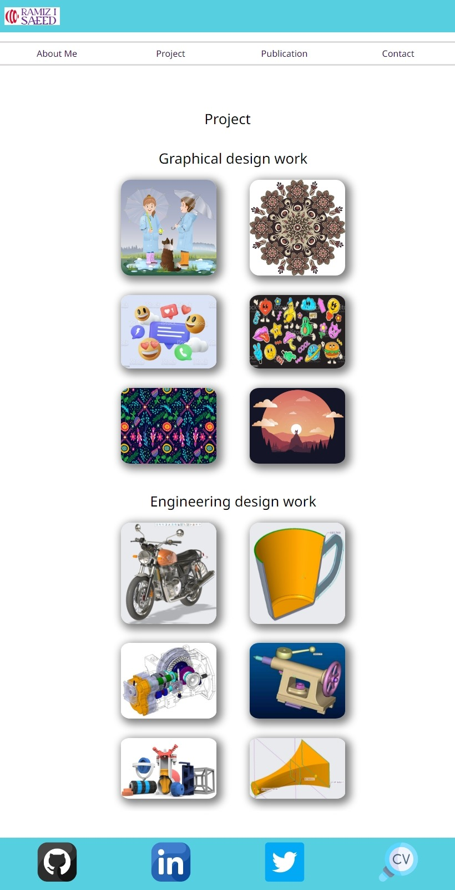
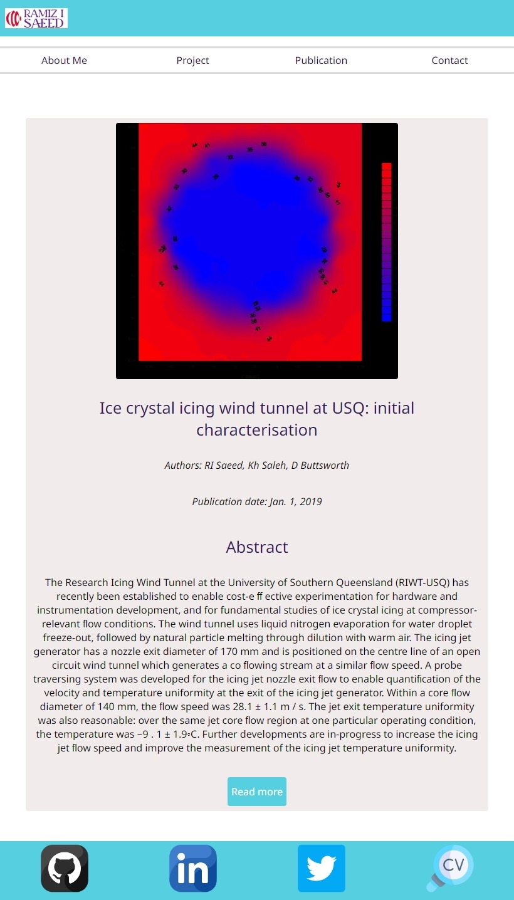

# Project T1A2 :Portfolio Website

  
  <h3 align="center">Portfolio Website</h3>

  

    A breif presentation of me as a web developer. 
     
    

 

## Table of contents
- [Project T1A2 :Portfolio Website](#project-t1a2-portfolio-website)
  - [Table of contents](#table-of-contents)
    - [The Purpose](#the-purpose)
      - [Host:](#host)
        - [https://ramiz-saeed-portfolio.netlify.app/](#httpsramiz-saeed-portfolionetlifyapp)
        - [https://github.com/RamizSaeed/Coder\_academy\_learning/tree/main/Coder\_academy\_learning/training/porto/assignments/t1a2](#httpsgithubcomramizsaeedcoder_academy_learningtreemaincoder_academy_learningtrainingportoassignmentst1a2)
        - [https://youtu.be/L5n5s6LVwgM](#httpsyoutubel5n5s6lvwgm)
    - [Functionality / features](#functionality--features)
    - [Sitemap](#sitemap)
    - [Wireframes](#wireframes)
    - [Screenshots](#screenshots)
      - [Desktop size](#desktop-size)
        - [Home Page:](#home-page)
        - [About Me Page:](#about-me-page)
        - [Project Page:](#project-page)
        - [Publication Page:](#publication-page)
          - [Publication 1 Page:](#publication-1-page)
          - [Publication 2 Page:](#publication-2-page)
          - [Publication 3 Page:](#publication-3-page)
          - [Publication 4 Page:](#publication-4-page)
          - [Publication 5 Page:](#publication-5-page)
        - [Contact Page:](#contact-page)
      - [Phone size](#phone-size)
        - [Home Page:](#home-page-1)
        - [About Me Page:](#about-me-page-1)
        - [Project Page:](#project-page-1)
        - [Publication List Page:](#publication-list-page)
          - [Publication 1 Page:](#publication-1-page-1)
          - [Publication 2 Page:](#publication-2-page-1)
          - [Publication 3 Page:](#publication-3-page-1)
          - [Publication 4 Page:](#publication-4-page-1)
          - [Publication 5 Page:](#publication-5-page-1)
        - [Contact Page:](#contact-page-1)
      - [Tablet size](#tablet-size)
        - [Home Page](#home-page-2)
        - [About Me Page:](#about-me-page-2)
        - [Project Page:](#project-page-2)
        - [Publication List Page:](#publication-list-page-1)
          - [Publication 1 Page:](#publication-1-page-2)
          - [Publication 2 Page:](#publication-2-page-2)
          - [Publication 3 Page:](#publication-3-page-2)
          - [Publication 4 Page:](#publication-4-page-2)
          - [Publication 5 Page:](#publication-5-page-2)
        - [Contact Page:](#contact-page-2)
      - [Target Audience:](#target-audience)
    - [Technical](#technical)
      - [Technology Used](#technology-used)
      - [How to run the project](#how-to-run-the-project)
    - [To Do List](#to-do-list)
      - [CONTRIBUTING](#contributing)

### The Purpose

This portfolio website contains information about my abilities, interests, and professional knowledge, as well as a presentation of my work to offer readers an overview about what I can do professionally a web developer.
The website demonstrates my abilities to use HTML and CSS code to design, develop, and deploy a website.
The webpage has been built up of  

#### Host:
The project is hosted in netlify 
##### https://ramiz-saeed-portfolio.netlify.app/

GitHub
##### https://github.com/RamizSaeed/Coder_academy_learning/tree/main/Coder_academy_learning/training/porto/assignments/t1a2

and Presentation video on YouTube
##### https://youtu.be/L5n5s6LVwgM

### Functionality / features
- Home Page: The home page provides a visually appealing introduction to my portfolio, featuring a brief overview of my background and a captivating image.

- About Me: This section provides detailed information about my skills, interests, and professional knowledge. It highlights my experience, education, and areas of expertise, allowing potential employers to gain a comprehensive understanding of my qualifications.

- Projects: The projects section showcases a selection of my notable projects. Each project includes a description, key features, technologies used, and a link to view the project in more detail. It demonstrates my ability to design and develop functional and visually appealing websites or applications.

- Skills: This section presents a comprehensive list of my technical skills and proficiencies. It includes programming languages, frameworks, tools, and other relevant skills. It allows employers to quickly assess my capabilities in specific areas.

- Contact Me: This feature provides a convenient way for potential employers to get in touch with me. It includes a contact form where they can enter their name, email, and message to initiate communication.

- Responsive Design: The portfolio website is designed to be responsive, ensuring that it is accessible and visually appealing across various devices and screen sizes.

- Professional Design: The website has a clean and modern design aesthetic, reflecting professionalism and attention to detail. The use of appropriate color schemes, typography, and layout enhances the overall user experience.

### Sitemap

### Wireframes

### Screenshots

#### Desktop size
##### Home Page:

##### About Me Page:

##### Project Page:

##### Publication Page:

###### Publication 1 Page:

###### Publication 2 Page:

###### Publication 3 Page:

###### Publication 4 Page:

###### Publication 5 Page:

##### Contact Page:

#### Phone size
##### Home Page:

##### About Me Page:

##### Project Page:

##### Publication List Page:

###### Publication 1 Page:

###### Publication 2 Page:

###### Publication 3 Page:

###### Publication 4 Page:

###### Publication 5 Page:

##### Contact Page:

#### Tablet size
##### Home Page

##### About Me Page:

##### Project Page:

##### Publication List Page:

###### Publication 1 Page:

###### Publication 2 Page:

###### Publication 3 Page:

###### Publication 4 Page:

###### Publication 5 Page:

##### Contact Page:

#### Target Audience:
The target audience for the portfolio website is employers, hiring managers, and recruiters who are evaluating me as a job candidate for a developer or IT professional position. They are expected to have technical knowledge in information technology, software development, coding, programming languages, and development stacks. They have high expectations of professionalism, including a positive work ethic. They are seeking a candidate who can demonstrate their skills, expertise, and experience through the portfolio website to assess their suitability for the job.

### Technical

#### Technology Used
This project uses:
   - HTML
   - CSS
   - Netlify.app
   - Balsamiq
   - Formspree
   - OBS Studio

#### How to run the project

You can:
    a.Click on the link provided OR
    b.Clone the project from GitHub 

### To Do List

List of features I am working on.

- [ ] Adding animations to the home page.
- [ ] Creating a slide show gallery.
- [ ] Adding Sidebar.
- [ ] Enhance the responsiveness of the project.
- [ ] Add real time blog posts.
- [ ] Uploading more projects.
- [x] Creating Logo image.

#### CONTRIBUTING

I would love to have your help in making  my portfolio better. The project is still not very complete, but if there's an suggestions please let me know.

